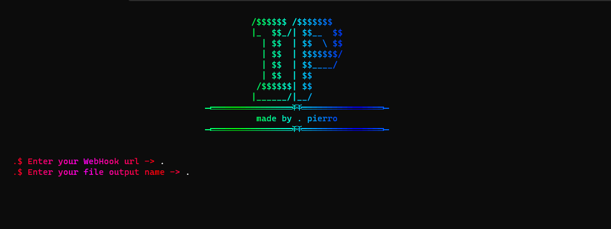

     
    <h1>
        IP Grabber
    </h1>
     
    <strong>by pierro</strong>

### Introduction

This tool is a POC to demonstrate how easy it is to grab someone's IP address using a Discord WebHook.

### How to use

Use main.py to build the payload, you might have to install the requirements using `pip install -r requirements.txt`

### Warning

This tool is for educational purposes & research only, do not use for malicious purposes.
I am not responsible for any damage caused by this tool.