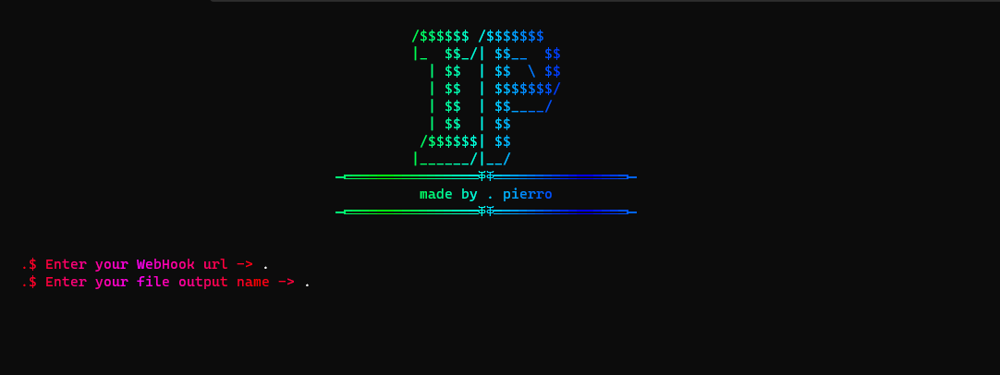

     
    <h1>
        A simple IP Grabber .exe file maker 😵‍💫
    </h1>
    <strong>by pierro</strong>

# Don't forget to install the requirements!
Just enter `pip install -r requirements.txt` after cloning this repository, then start Grab.py

# To use it just start Grab.py
It'll ask for you Discord WebHook (to send the IP) and compile it to an .exe

*Use it for educational purpose i'm not responsible for your actions*